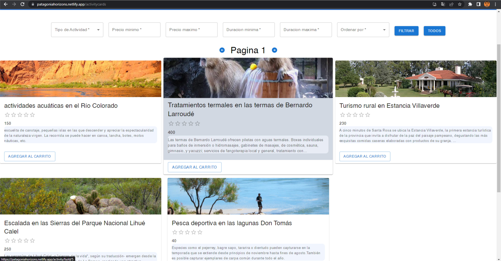
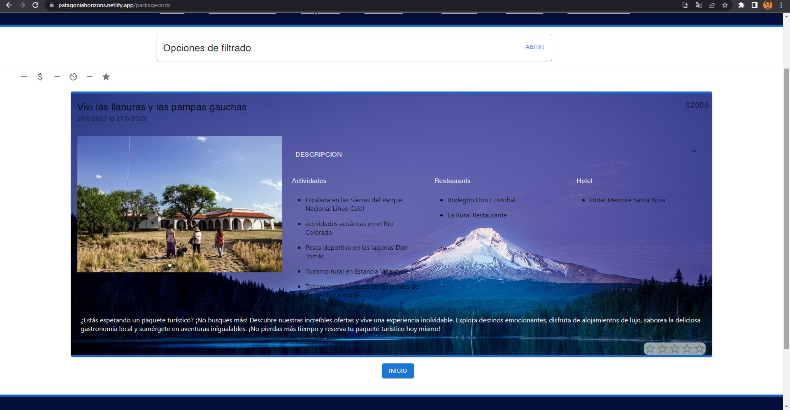

# **Henry** | Proyecto Final

## **Descripción**

App desarrollada como proyecto final del curso Full Stack developer de Henry junto a 5 compañeros.
La app está pensada para hacer mas facil y dinamica la organizacion de vacaciones en la Patagonia.
Los usuarios pueden elegir y reservar paquetes de turismo pre armados, con distintas actividades para realizar,
restautantes donde comer y el hotel donde se hospedarán.
Tambien pueden armar su carrito con las actividades y el hotel que elijan.

<br />

---

## **Funcionalidades**

En la app se puede:

Usuario:
- Ver los distintos paquetes 
- Comprar un paquete
- Armar un carrito personalizado
- Pagar con PayPal o tarjeta
- Ingresar con una cuenta de la app o con tu cuenta de Google
- Ver hoteles, restaurantes y actividades
- Dejar comentarios y puntuaciones a paquetes, hoteles, restaurantes y actividades
- Filtrar y ordenar paquetes, hoteles, restaurantes y actividades por precio, estrellas, duracion, tipo y rating de los comentarios
- Buscar paquetes, hoteles, restaurantes y actividades por nombre
- Ver tus reservas y cancelarlas

Administrador:
- Crear paquetes, hoteles, restaurantes y actividades
- Ver las reservas 
- Mandar spam a los usuarios que asi lo requieran
- mandar avisos sobre las reservas que estan a una semana de la fecha de inicio
- Borrar paquetes, hoteles, restaurantes y actividades


<br />

---

## **Colaboradores**

- Lucas Guerendiain
- Elias Yanzon
- Marcos Adrian Muga
- Omar Gomez
- Agustín Ovalle


<br />

---

## **Tecnologias usadas**

- React
- Redux Toolkit
- Material UI
- Express
- Sequalize
- PostgreSQL
- Auth0
- PayPal

<br />

---

## **PARA COMENZAR...**

   ```bash
   npm install
   npm start
   ```

<br />

---

## **Capturas de la app**




